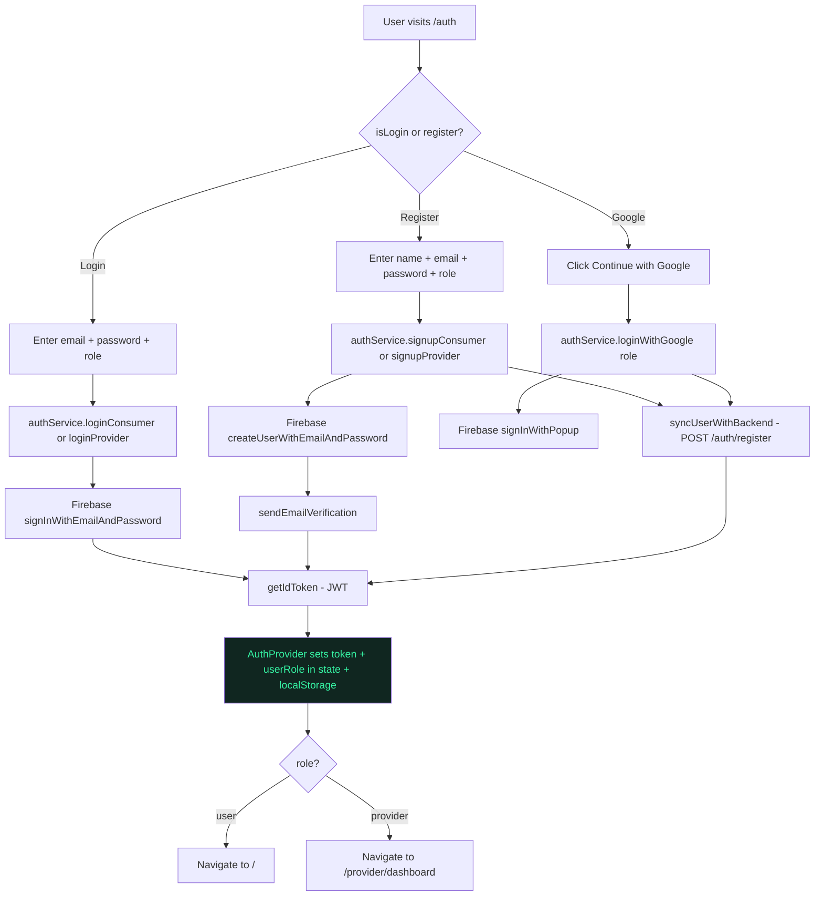
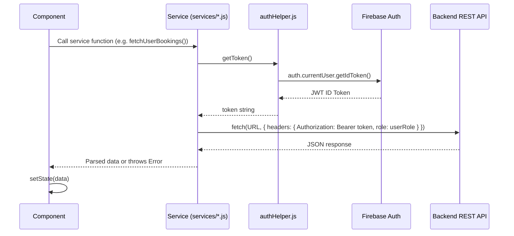
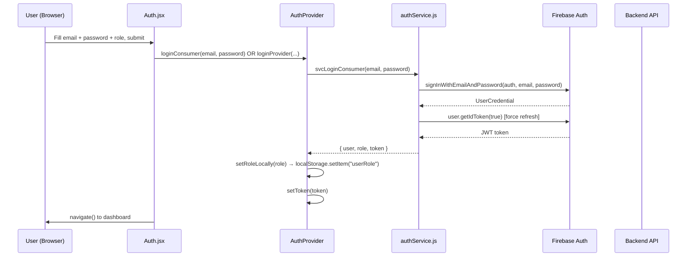
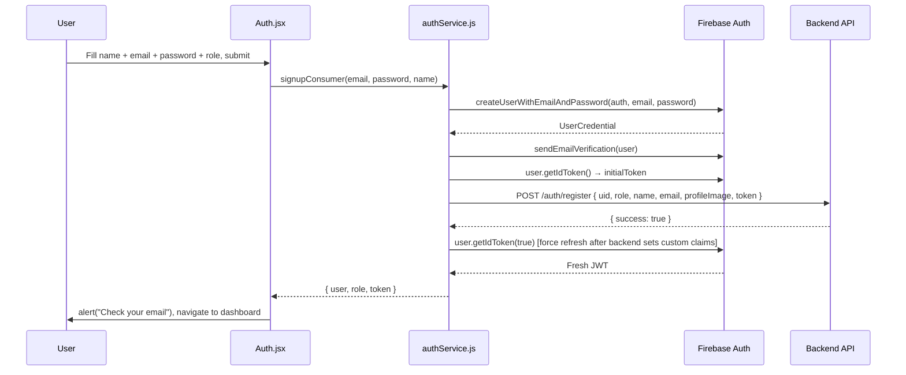
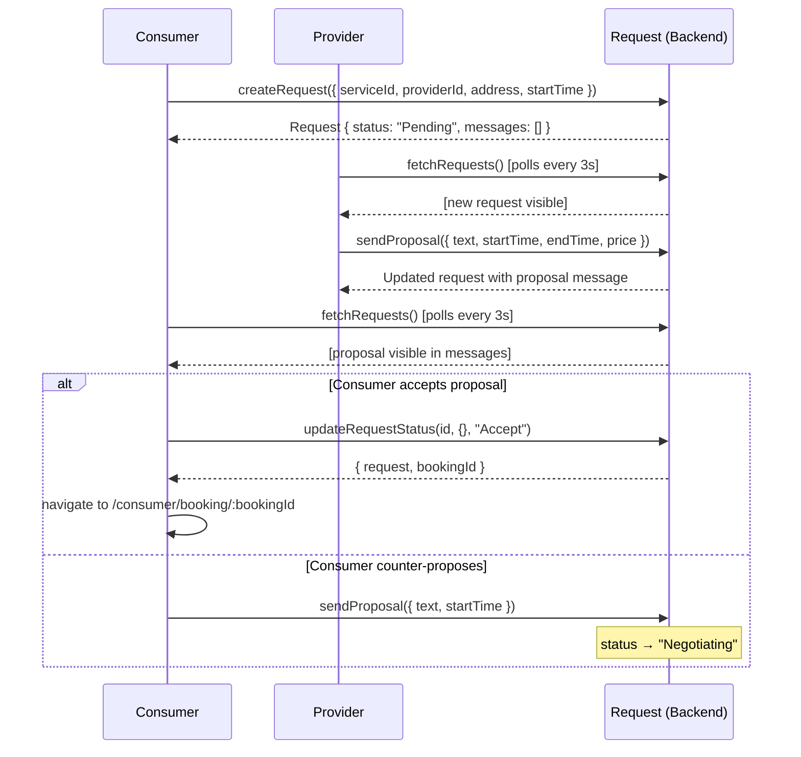
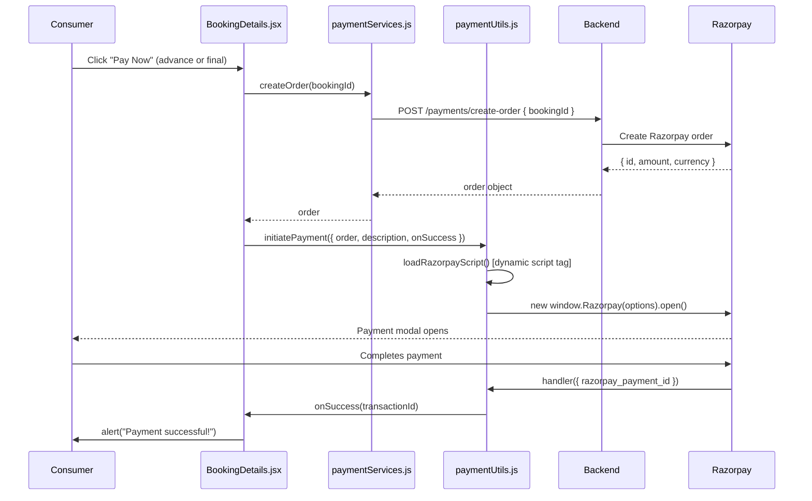
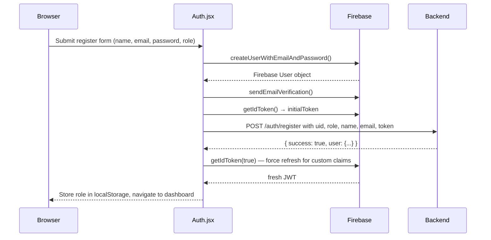
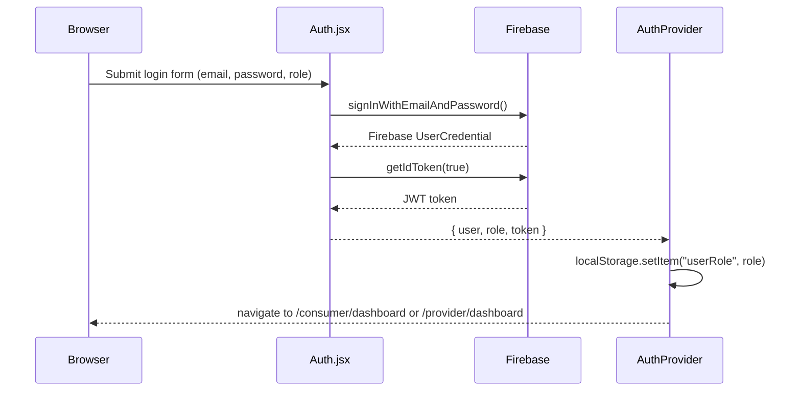
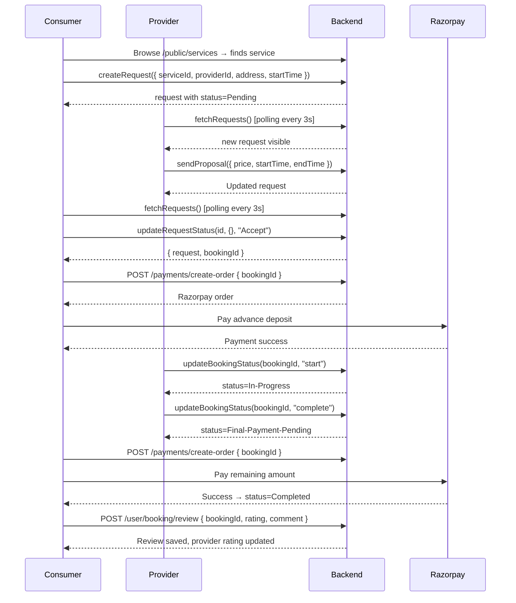

# 📘 PROJECT_FLOW.md — LocalServe

> **A comprehensive technical reference for developers joining the LocalServe project.**
> Covers architecture, data flow, component relationships, auth, payments, and onboarding.

---

## 📋 Table of Contents

1. [Project Overview](#1-project-overview)
2. [Technology Stack](#2-technology-stack)
3. [Folder Structure](#3-folder-structure)
4. [Application Flow](#4-application-flow)
   - [4.1 Startup Process](#41-startup-process)
   - [4.2 Routing & Navigation](#42-routing--navigation)
   - [4.3 Authentication Flow](#43-authentication-flow)
   - [4.4 Data Fetching Flow](#44-data-fetching-flow)
   - [4.5 State Management Flow](#45-state-management-flow)
   - [4.6 API Request Lifecycle](#46-api-request-lifecycle)
5. [Component Analysis](#5-component-analysis)
6. [Frontend Analysis](#6-frontend-analysis)
   - [6.1 Page Structure](#61-page-structure)
   - [6.2 Component Hierarchy](#62-component-hierarchy)
   - [6.3 Routing Structure](#63-routing-structure)
   - [6.4 Form Handling](#64-form-handling)
7. [Backend Analysis](#7-backend-analysis)
8. [Authentication & Authorization](#8-authentication--authorization)
9. [Important Business Logic](#9-important-business-logic)
   - [9.1 Booking Lifecycle](#91-booking-lifecycle)
   - [9.2 Request & Negotiation Flow](#92-request--negotiation-flow)
   - [9.3 Payment Flow](#93-payment-flow)
10. [Sequence Diagrams](#10-sequence-diagrams)
11. [Dependency Graph](#11-dependency-graph)
12. [Environment Configuration](#12-environment-configuration)
13. [Potential Issues & Technical Debt](#13-potential-issues--technical-debt)
14. [Developer Onboarding Guide](#14-developer-onboarding-guide)

---

## 1. Project Overview

### What Is LocalServe?

**LocalServe** is a full-stack web marketplace platform that connects **consumers** (people who need home services) with **providers** (freelance professionals who offer services like plumbing, AC repair, electrical work, and home cleaning).

Think of it as an **Uber for home services** — but with a built-in negotiation engine, milestone-based payments, and a review system.

### Problem It Solves

Finding trustworthy local service professionals is fragmented and unreliable. LocalServe centralizes it with:
- Verified professional profiles with ratings & portfolios
- A transparent request ↔ proposal negotiation system
- Milestone-based payments (advance + final) via Razorpay
- A real-time-like messaging thread for consumer-provider communication

### Target Users

| Role | Description |
|---|---|
| **Consumer (user)** | Homeowners or residents looking to book local services |
| **Provider** | Skilled professionals offering home services |
| **Admin** | Platform administrators who moderate users, services, bookings, reviews, and commissions |

### Overall Architecture

```
┌─────────────────────────────────────────────────────┐
│               Browser (React SPA)                   │
│  ┌──────────────┐  ┌──────────────┐  ┌───────────┐  │
│  │  Public Pages│  │ Consumer SPA │  │Provider   │  │
│  │  (Landing,   │  │ (Dashboard,  │  │SPA (Jobs, │  │
│  │  Auth, etc.) │  │  Bookings,   │  │Services,  │  │
│  └──────────────┘  │  Requests)   │  │Earnings)  │  │
│                    └──────────────┘  └───────────┘  │
│         ↓ Firebase Auth (JWT tokens)                 │
│         ↓ REST API calls (Bearer token + role header)│
└─────────────────────────────────────────────────────┘
                       │
       ┌───────────────▼───────────────────┐
       │      Backend REST API             │
       │      (Node.js / Express)          │
       │      http://localhost:5000/api    │
       └───────────────┬───────────────────┘
                       │
              ┌────────▼────────┐
              │   Database      │
              │   (MongoDB)     │
              └─────────────────┘
```

The frontend is a **React 19 + Vite SPA** deployed to GitHub Pages. It communicates with a **separate Express backend** via REST APIs. Authentication is handled by **Firebase Auth** (email/password + Google OAuth). Payments are processed via **Razorpay**.

---

## 2. Technology Stack

### Frontend Dependencies

| Package | Version | Why It's Used |
|---|---|---|
| `react` | ^19.2.0 | Core UI library — renders the SPA with a component tree |
| `react-dom` | ^19.2.0 | Mounts React to the actual DOM |
| `react-router-dom` | ^7.14.0 | Client-side routing — maps URLs to page components |
| `firebase` | ^12.12.1 | Firebase Auth SDK — handles login/signup/Google OAuth and provides JWT tokens |
| `@chakra-ui/react` | ^2.10.9 | UI component library (imported but mostly unused — custom CSS components are preferred) |
| `@emotion/react` + `@emotion/styled` | ^11.x | Required peer dependencies for Chakra UI |
| `framer-motion` | ^12.38.0 | Animation library — powers UI transitions and motion effects |
| `react-icons` | ^5.6.0 | Icon library (Feather icons used throughout the app via `react-icons/fi`) |
| `browser-image-compression` | ^2.0.2 | Compresses images before upload to reduce bandwidth |

### Dev Dependencies

| Package | Why It's Used |
|---|---|
| `vite` | Ultra-fast build tool and dev server replacing Webpack |
| `@vitejs/plugin-react` | Adds JSX transform and Fast Refresh support to Vite |
| `eslint` + plugins | Code linting to enforce consistent style |
| `gh-pages` | CLI tool to deploy the built `dist/` folder to GitHub Pages |

### External Services

| Service | Purpose |
|---|---|
| **Firebase Authentication** | Identity provider — manages user sessions, issues JWT ID tokens |
| **Razorpay** | Indian payment gateway — processes advance and final service payments |
| **Google Fonts (Inter)** | Typography — loaded via CSS `@import` in `index.css` |
| **Backend REST API** | All business data (bookings, services, requests, profiles) lives here |

---

## 3. Folder Structure

```
localservices/                         ← Project root
│
├── .env                               ← Environment variables (Firebase, Razorpay, API URL)
├── index.html                         ← Vite entry point HTML — mounts <div id="root">
├── vite.config.js                     ← Vite config (React plugin, base path)
├── package.json                       ← Dependencies & npm scripts
├── eslint.config.js                   ← ESLint rules
├── DESIGN.md                          ← UI design system specification
├── README.md                          ← Basic project description
│
├── public/                            ← Static assets (images used in landing page)
│   └── images/                        ← Category images: HouseCleaning, Electrician, etc.
│
├── dist/                              ← Production build output (generated by `npm run build`)
│
└── src/                               ← All application source code
    │
    ├── main.jsx                       ← 🔑 App entry point — sets up Provider tree + BrowserRouter
    ├── App.jsx                        ← Thin shell — just renders <AppRoutes />
    ├── ScrollToTop.jsx                ← Resets scroll position on every route change
    ├── index.css                      ← 🎨 Global design system (CSS vars, typography, utilities)
    │
    ├── config/
    │   └── firebase.js                ← Initializes Firebase app, exports `auth` & `googleProvider`
    │
    ├── context/
    │   ├── AuthContext.jsx            ← createContext() + useAuth() hook definition
    │   ├── AuthProvider.jsx           ← 🔑 Manages auth state: currentUser, token, userRole
    │   ├── UserContext.jsx            ← createContext() + useUser() hook definition
    │   └── UserProvider.jsx           ← Fetches & caches logged-in user's profile from backend
    │
    ├── routes/
    │   └── AppRoutes.jsx              ← 🗺️ Defines ALL route → component mappings (100 lines)
    │
    ├── layouts/
    │   ├── PublicLayout.jsx           ← Wraps public pages: Navbar + Outlet + Footer
    │   ├── DashboardLayout.jsx        ← Sidebar nav + header for consumer & provider dashboards
    │   └── AdminLayout.jsx            ← Sidebar nav + header for admin panel (reuses Dashboard CSS)
    │
    ├── pages/
    │   ├── public/                    ← Accessible without login
    │   │   ├── LandingPage.jsx        ← Hero, categories, featured providers, reviews
    │   │   ├── CategoriesPage.jsx     ← Browse all service categories
    │   │   ├── ServiceListing.jsx     ← Services filtered by category with pagination
    │   │   ├── ProvidersPage.jsx      ← All providers with infinite scroll / pagination
    │   │   ├── ProviderDetail.jsx     ← Individual provider profile + services + reviews
    │   │   └── Auth.jsx               ← Login / Register / Forgot Password (role-aware)
    │   │
    │   ├── consumer/                  ← Protected: requires role="user"
    │   │   ├── Dashboard.jsx          ← Upcoming bookings, pending payments, quick search
    │   │   ├── BookingFlow.jsx        ← 3-step wizard to create a service request
    │   │   ├── MyBookings.jsx         ← List of all consumer bookings with status filters
    │   │   ├── BookingDetails.jsx     ← Full booking tracker + payment + review submission
    │   │   ├── Requests.jsx           ← Request hub: messaging + negotiation + accept proposal
    │   │   ├── Messaging.jsx          ← Direct messages page
    │   │   ├── Payments.jsx           ← Payment history / transactions
    │   │   ├── Profile.jsx            ← View consumer profile
    │   │   └── EditProfile.jsx        ← Edit name, phone, addresses, profile image
    │   │
    │   ├── provider/                  ← Protected: requires role="provider"
    │   │   ├── Dashboard.jsx          ← Stats, new requests, upcoming jobs
    │   │   ├── Onboarding.jsx         ← 3-step wizard for new provider setup
    │   │   ├── BookingRequests.jsx    ← Request hub: messaging + negotiation + accept/propose
    │   │   ├── ManageServices.jsx     ← List & delete provider's services
    │   │   ├── AddService.jsx         ← Form to add a new service offering
    │   │   ├── EditService.jsx        ← Form to edit an existing service
    │   │   ├── MyJobs.jsx             ← Active and completed jobs list
    │   │   ├── BookingDetails.jsx     ← Job tracker: mark in-progress, complete, etc.
    │   │   ├── Earnings.jsx           ← Transaction history and earnings summary
    │   │   ├── Profile.jsx            ← View provider profile + portfolio
    │   │   └── EditProfile.jsx        ← Edit bio, skills, portfolio images, availability
    │   │
    │   └── admin/                     ← Admin panel (no ProtectedRoute guard — see issues)
    │       ├── AdminDashboard.jsx     ← Platform-wide stats
    │       ├── UserManagement.jsx     ← View, search, and manage users
    │       ├── ServiceManagement.jsx  ← Approve/reject/list services
    │       ├── BookingManagement.jsx  ← View all bookings across platform
    │       ├── PaymentsCommission.jsx ← Commission settings and payment oversight
    │       └── ReviewModeration.jsx   ← Approve/reject/flag reviews
    │
    ├── components/
    │   ├── auth/
    │   │   ├── LoginForm.jsx          ← Email + password fields + submit (used by Auth.jsx)
    │   │   └── RegisterForm.jsx       ← Name + email + password fields (used by Auth.jsx)
    │   │
    │   ├── common/
    │   │   ├── Navbar.jsx             ← Top navigation bar (role-aware links, scroll effect)
    │   │   ├── Footer.jsx             ← Site footer with links
    │   │   └── ProtectedRoute.jsx     ← Route guard: checks auth + role before rendering
    │   │
    │   ├── dashboard/
    │   │   ├── StatCard.jsx           ← Small card showing a metric (title + value/icon)
    │   │   ├── ConsumerBookingCard.jsx ← Booking summary card for consumer dashboard
    │   │   └── ProviderJobCard.jsx    ← Job summary card for provider dashboard
    │   │
    │   ├── requests/
    │   │   ├── MessageThread.jsx      ← Renders the conversation history for a request
    │   │   ├── NegotiationForm.jsx    ← Form for sending text messages or proposals
    │   │   └── RequestListSidebar.jsx ← Left-side list of requests with tab filtering
    │   │
    │   └── ui/
    │       ├── Button.jsx + Button.css  ← Reusable button (variants: primary, secondary, ghost, outline)
    │       ├── Card.jsx + Card.css      ← Content card (elevations: subtle, medium)
    │       ├── Input.jsx + Input.css    ← Labeled input field wrapper
    │       └── Badge.jsx + Badge.css    ← Small status label
    │
    ├── services/
    │   ├── authService.js             ← Firebase Auth operations + backend sync
    │   ├── bookingServices.js         ← Fetch user bookings, create booking, fetch service details
    │   ├── providerServices.js        ← CRUD for provider services, bookings, profile, transactions
    │   ├── publicServices.js          ← Unauthenticated: fetch services, providers, featured
    │   ├── requestService.js          ← CRUD for service requests + messaging + proposals
    │   ├── reviewServices.js          ← Submit a review after booking completion
    │   ├── paymentServices.js         ← Create Razorpay order
    │   └── userService.js             ← Update consumer profile, fetch transactions
    │
    └── utils/
        ├── authHelper.js              ← `getToken()` helper — reliably fetches Firebase ID token
        ├── paymentUtils.js            ← Loads Razorpay SDK + opens payment modal
        ├── statusUtils.js             ← Maps request status → color (bg + text)
        └── formatMessageTime.js       ← Formats message timestamps (Today / Yesterday / Date)
```

### How Folders Interact

```
main.jsx
  └── AuthProvider (context/AuthProvider.jsx)
        └── UserProvider (context/UserProvider.jsx)
              └── BrowserRouter + ScrollToTop
                    └── App.jsx
                          └── AppRoutes.jsx (routes/)
                                ├── PublicLayout (layouts/)
                                │     ├── Navbar (components/common/)
                                │     ├── [public pages] (pages/public/)
                                │     └── Footer (components/common/)
                                ├── DashboardLayout (layouts/)
                                │     ├── ProtectedRoute (components/common/)
                                │     └── [consumer/provider pages] → use services/ + utils/
                                └── AdminLayout (layouts/)
                                      └── [admin pages]
```

---

## 4. Application Flow

### 4.1 Startup Process

When a user opens the app in a browser:

```
1. Browser loads index.html
2. Vite injects the bundled JS (main.jsx is the entry)
3. React renders the Provider tree:
   AuthProvider
   └── UserProvider
         └── BrowserRouter
               └── ScrollToTop (resets scroll on navigation)
                     └── App → AppRoutes

4. AuthProvider mounts → subscribes to Firebase onAuthStateChanged
   - If a Firebase session exists: sets currentUser, fetches JWT token, reads userRole from localStorage
   - Otherwise: sets all auth state to null, sets isLoading = false

5. UserProvider watches AuthProvider state:
   - Once auth is resolved (isLoading = false):
     - If logged in: fetches profile from backend (/user/me or /provider/me)
     - Stores profile in UserContext

6. AppRoutes renders the matching page component
```

### 4.2 Routing & Navigation

The app uses **React Router v7** with nested route layouts.

```
URL Pattern                        Component                Layout
──────────────────────────────────────────────────────────────────────
/                                  LandingPage              PublicLayout
/services                          CategoriesPage           PublicLayout
/services/:category                ServiceListing           PublicLayout
/providers                         ProvidersPage            PublicLayout
/provider/:id                      ProviderDetail           PublicLayout
/auth                              Auth                     PublicLayout
/consumer/book                     BookingFlow              PublicLayout (no auth required on route level — guarded by useEffect inside)

/consumer/dashboard                ConsumerDashboard        DashboardLayout + ProtectedRoute(role=user)
/consumer/bookings                 MyBookings               DashboardLayout + ProtectedRoute(role=user)
/consumer/bookings/:id             BookingDetails           DashboardLayout + ProtectedRoute(role=user)
/consumer/booking/:id              BookingDetails           DashboardLayout + ProtectedRoute(role=user)
/consumer/messages                 Messaging                DashboardLayout + ProtectedRoute(role=user)
/consumer/payments                 Payments                 DashboardLayout + ProtectedRoute(role=user)
/consumer/profile                  ConsumerProfile          DashboardLayout + ProtectedRoute(role=user)
/consumer/profile/edit             EditConsumerProfile      DashboardLayout + ProtectedRoute(role=user)
/consumer/requests                 Requests                 DashboardLayout + ProtectedRoute(role=user)

/provider/dashboard                ProviderDashboard        DashboardLayout + ProtectedRoute(role=provider)
/provider/onboarding               ProviderOnboarding       DashboardLayout + ProtectedRoute(role=provider)
/provider/services                 ManageServices           DashboardLayout + ProtectedRoute(role=provider)
/provider/services/add             AddService               DashboardLayout + ProtectedRoute(role=provider)
/provider/services/edit/:id        EditService              DashboardLayout + ProtectedRoute(role=provider)
/provider/earnings                 ProviderEarnings         DashboardLayout + ProtectedRoute(role=provider)
/provider/requests                 BookingRequests          DashboardLayout + ProtectedRoute(role=provider)
/provider/jobs                     MyJobs                   DashboardLayout + ProtectedRoute(role=provider)
/provider/job/:id                  ProviderBookingDetails   DashboardLayout + ProtectedRoute(role=provider)
/provider/profile                  ProviderProfile          DashboardLayout + ProtectedRoute(role=provider)
/provider/profile/edit             EditProviderProfile      DashboardLayout + ProtectedRoute(role=provider)

/admin/dashboard                   AdminDashboard           AdminLayout (NO auth guard)
/admin/users                       UserManagement           AdminLayout
/admin/services                    ServiceManagement        AdminLayout
/admin/bookings                    BookingManagement        AdminLayout
/admin/settings                    PaymentsCommission       AdminLayout
/admin/reviews                     ReviewModeration         AdminLayout
```

**Key routing patterns:**
- **Layout routes**: Layouts are parent `<Route element={<Layout />}>` wrappers that render `<Outlet />`.
- **ProtectedRoute**: A wrapper route that checks `isAuthenticated` and `userRole`, then either renders the `<Outlet />` or redirects.
- **Duplicate booking routes**: Both `/consumer/bookings/:id` and `/consumer/booking/:id` render the same `BookingDetails` component (slightly inconsistent naming).

### 4.3 Authentication Flow



**Token refresh**: Firebase tokens expire every hour. The `getToken()` util in `authHelper.js` always calls `user.getIdToken()` which automatically refreshes tokens when needed.

**Cross-tab sync**: `AuthProvider` listens to `window storage` events so if one tab logs out (removes `userRole` from localStorage), other tabs update their auth state too.

### 4.4 Data Fetching Flow

All API calls follow this pattern:

```
Page Component (useEffect)
  └── Service Function (services/*.js)
        └── getToken() from authHelper.js
              └── auth.currentUser.getIdToken()
        └── fetch(API_URL + endpoint, { headers: { Authorization: Bearer token, role: userRole } })
        └── Parse JSON response
        └── Return data or throw Error
  ← Component sets data into local useState
```

**Polling pattern**: Some pages (Requests, BookingDetails) use `setInterval` to auto-refresh data every 3 seconds, simulating real-time updates:
```js
const interval = setInterval(getRequests, 3000);
return () => clearInterval(interval);  // cleanup on unmount
```

### 4.5 State Management Flow

The app uses **React Context API** (no Redux/Zustand). There are exactly two global contexts:

```
AuthContext (AuthProvider.jsx)
├── currentUser        ← Firebase User object (or null)
├── token              ← Firebase JWT ID token (string or null)
├── userRole           ← 'user' | 'provider' | null
├── isAuthenticated    ← Boolean: !!currentUser || !!token
├── isLoading          ← Boolean: true while Firebase resolves session
└── methods: loginConsumer, loginProvider, signupConsumer, signupProvider,
             loginWithGoogle, logout

UserContext (UserProvider.jsx)
├── user               ← Full profile object from backend (/user/me or /provider/me)
├── setUser            ← Expose setter so EditProfile pages can update the profile locally
└── profileLoading     ← Boolean: true while profile is being fetched
```

All other state is **local component state** using `useState`:
- Booking data in BookingDetails
- Request list in Requests / BookingRequests
- Form fields in all edit forms
- Pagination cursors in ServiceListing, ProvidersPage

### 4.6 API Request Lifecycle



**Headers sent with every authenticated request:**
```js
{
  "Authorization": "Bearer <Firebase JWT>",
  "role": "user" | "provider"   // tells backend which model to query
}
```

---

## 5. Component Analysis

### 5.1 Layout Components

#### `PublicLayout` — [`src/layouts/PublicLayout.jsx`](src/layouts/PublicLayout.jsx)
- **Purpose**: Wraps all public-facing pages with a consistent top navigation and footer.
- **Structure**: `Navbar → <Outlet /> → Footer`
- **Why**: Avoids repeating Navbar/Footer in every public page. Outlet renders the matched child route.

#### `DashboardLayout` — [`src/layouts/DashboardLayout.jsx`](src/layouts/DashboardLayout.jsx)
- **Purpose**: Provides the sidebar navigation UI for both consumer and provider dashboards.
- **Key logic**: `isProvider = location.pathname.includes("/provider")` — dynamically switches nav links based on URL. No separate layout for each role.
- **Features**: Collapsible mobile sidebar with overlay, avatar with profile image, logout button.
- **Inputs**: `useAuth()` for logout, `useUser()` for avatar display.

#### `AdminLayout` — [`src/layouts/AdminLayout.jsx`](src/layouts/AdminLayout.jsx)
- **Purpose**: Separate sidebar for admin panel.
- **Note**: Reuses `DashboardLayout.css` for sidebar styling consistency.
- **⚠️ No auth guard**: The admin routes have no `ProtectedRoute` — this is a security gap.

### 5.2 Common Components

#### `ProtectedRoute` — [`src/components/common/ProtectedRoute.jsx`](src/components/common/ProtectedRoute.jsx)
- **Purpose**: Acts as a route guard. Prevents unauthorized access.
- **Props**: `allowedRole` — if provided, checks that `userRole === allowedRole`.
- **Behavior**:
  - Shows "Loading..." while `isLoading = true` (waiting for Firebase to resolve)
  - Redirects to `/auth` if not authenticated
  - Redirects to own dashboard if authenticated but wrong role

#### `Navbar` — [`src/components/common/Navbar.jsx`](src/components/common/Navbar.jsx)
- **Purpose**: Top navigation bar shown on all public pages.
- **Inputs**: `useAuth()` for role + logout, `useUser()` for avatar.
- **Behavior**: Shows different nav links based on role. Adds `.scrolled` class after 50px scroll (for blur/border effect). Mobile hamburger menu with overlay.

### 5.3 UI Components (Design System)

| Component | File | Props | Purpose |
|---|---|---|---|
| `Button` | `components/ui/Button.jsx` | `variant` (primary/secondary/ghost/outline), `onClick`, `type` | Styled clickable button |
| `Card` | `components/ui/Card.jsx` | `elevation` (subtle/medium), `className`, `onClick` | Content container card |
| `Input` | `components/ui/Input.jsx` | `label`, `type`, `name`, `value`, `onChange`, `placeholder`, `required` | Labeled form input |
| `Badge` | `components/ui/Badge.jsx` | `children`, `style` | Small status/label chip |

### 5.4 Dashboard Components

#### `StatCard` — [`src/components/dashboard/StatCard.jsx`](src/components/dashboard/StatCard.jsx)
- **Props**: `title`, `value`, `icon`
- **Purpose**: Shows a metric (e.g., "Monthly Earnings: ₹1,240")

#### `ConsumerBookingCard` — [`src/components/dashboard/ConsumerBookingCard.jsx`](src/components/dashboard/ConsumerBookingCard.jsx)
- **Props**: `booking` (object), `onManage` (callback)
- **Purpose**: Summary card for an upcoming booking shown on consumer dashboard

#### `ProviderJobCard` — [`src/components/dashboard/ProviderJobCard.jsx`](src/components/dashboard/ProviderJobCard.jsx)
- **Props**: `title`, `badgeText`, `subtitle`, `buttonText`, `buttonVariant`, `onAction`
- **Purpose**: Compact job/request card for provider dashboard

### 5.5 Request Components

#### `RequestListSidebar` — [`src/components/requests/RequestListSidebar.jsx`](src/components/requests/RequestListSidebar.jsx)
- **Props**: `requests`, `activeTab`, `setActiveTab`, `selectedRequestId`, `setSelectedRequestId`, `tabs`
- **Purpose**: Left panel showing filtered list of requests. Clicking one sets `selectedRequestId`.

#### `MessageThread` — [`src/components/requests/MessageThread.jsx`](src/components/requests/MessageThread.jsx)
- **Props**: `messages` (array), `messagesEndRef` (ref for scroll), `userRole` ("consumer" | "provider")
- **Purpose**: Renders the conversation history with differentiated bubbles for proposals vs text messages.

#### `NegotiationForm` — [`src/components/requests/NegotiationForm.jsx`](src/components/requests/NegotiationForm.jsx)
- **Props**: `negotiationData`, `setNegotiationData`, `handleAction`, `selectedRequest`, `isProvider`
- **Purpose**: The input form for sending a text message or a proposal (with pricing/timing). Behavior differs between consumer and provider views.

---

## 6. Frontend Analysis

### 6.1 Page Structure

**Public Pages** (no auth required):
- `LandingPage`: Hero → Popular Services categories → Top Rated Providers → Customer Reviews
- `CategoriesPage`: Grid of all service categories
- `ServiceListing`: Services filtered by `:category` URL param, with cursor-based pagination (limit 4)
- `ProvidersPage`: All providers with cursor-based pagination
- `ProviderDetail`: Provider bio, services, portfolio, ratings
- `Auth`: Login / Register / Forgot Password — role selector between "consumer" and "provider"

**Consumer Protected Pages**:
- `Dashboard`: Pending payments alert + upcoming bookings + quick service search
- `BookingFlow`: 3-step wizard (Details → Schedule → Review) → creates a Request
- `MyBookings`: Filterable list of all consumer bookings
- `BookingDetails`: Booking status tracker with payment buttons and review form
- `Requests`: Two-panel layout — sidebar list + detail view with messaging/negotiation
- `Messaging`: Direct message conversations
- `Payments`: Transaction history
- `Profile` / `EditProfile`: View and update consumer account info

**Provider Protected Pages**:
- `Dashboard`: Stats row + new requests + upcoming jobs
- `Onboarding`: 3-step wizard for new providers (Verification → Services → Bank Info) — UI only, not wired to backend
- `BookingRequests`: Two-panel layout — same design as consumer Requests but with provider-specific proposal logic
- `ManageServices` / `AddService` / `EditService`: Full CRUD for service offerings
- `MyJobs`: All confirmed/in-progress/completed jobs
- `BookingDetails`: Job tracker — mark start, mark complete, view payment status
- `Earnings`: Financial transaction history
- `Profile` / `EditProfile`: Manage bio, portfolio images, skills, availability toggle

### 6.2 Component Hierarchy

```
App
└── AppRoutes
    ├── PublicLayout
    │   ├── Navbar
    │   ├── LandingPage / CategoriesPage / ServiceListing / ...
    │   └── Footer
    │
    ├── DashboardLayout (consumer or provider, determined by URL)
    │   └── ProtectedRoute
    │       └── ConsumerDashboard
    │           ├── StatCard (×3)
    │           └── ConsumerBookingCard (×n)
    │       └── Requests
    │           ├── RequestListSidebar
    │           ├── MessageThread
    │           └── NegotiationForm
    │       └── BookingDetails
    │           ├── Card (status sections)
    │           └── Button (Pay Now / Pay Remaining)
    │
    └── AdminLayout
        └── AdminDashboard / UserManagement / ...
```

### 6.3 Routing Structure

The app uses **three layout routes**:
1. `PublicLayout` — wraps `/`, `/services/**`, `/providers/**`, `/auth`, `/consumer/book`
2. `DashboardLayout` — wraps all `/consumer/**` and `/provider/**` authenticated pages
3. `AdminLayout` — wraps all `/admin/**` pages

The `DashboardLayout` uses a smart trick: instead of two separate layouts for consumer and provider, it reads `location.pathname.includes("/provider")` to switch the nav links dynamically.

### 6.4 Form Handling and Validation

All forms use **controlled React state** — no form library (e.g., React Hook Form). Pattern:

```jsx
const [formData, setFormData] = useState({ name: '', email: '' });

const handleChange = (e) => {
  setFormData(prev => ({ ...prev, [e.target.name]: e.target.value }));
};
```

Validation is done inline before API calls with `alert()` messages (basic approach):
```js
if (!formData.service || !formData.address) {
  alert("Please fill all required fields");
  return;
}
```

Firebase auth errors are mapped to human-readable messages in `Auth.jsx` via `getHumanReadableError(code)`.

---

## 7. Backend Analysis

> ⚠️ The backend source code is not included in this repository. It runs separately at `http://localhost:5000`. This section documents the API contract inferred from the frontend service files.

### Server Architecture

The backend is a **Node.js/Express REST API** with MongoDB as the database. It:
1. Verifies Firebase JWT tokens (passed as `Authorization: Bearer <token>`)
2. Reads the `role` header to route to correct MongoDB model
3. Returns JSON responses with `{ success: boolean, data... }` shape

### All API Endpoints (Inferred)

#### Public (no auth)
| Method | Endpoint | Description |
|---|---|---|
| GET | `/public/services?cursor=&limit=4&category=` | Paginated list of services by category |
| GET | `/public/providers?cursor=` | Paginated list of providers |
| GET | `/public/providers/featured` | Featured/top-rated providers for landing page |
| GET | `/public/providers/:id` | Single provider's full profile |

#### Auth
| Method | Endpoint | Description |
|---|---|---|
| POST | `/auth/register` | Create/sync user in DB after Firebase signup |

#### Consumer (role: user)
| Method | Endpoint | Description |
|---|---|---|
| GET | `/user/me` | Fetch consumer's own profile |
| PATCH | `/user/me` | Update consumer profile (multipart/form-data with image) |
| GET | `/user/bookings/?upComingBookings=&pendingPayment=` | Fetch user's bookings with filters |
| GET | `/user/booking/?bookingId=` | Fetch single booking by ID |
| POST | `/user/bookings/:uid` | Create a new booking |
| POST | `/user/booking/review` | Submit a review for a completed booking |
| GET | `/user/transactions` | Fetch payment transaction history |

#### Provider (role: provider)
| Method | Endpoint | Description |
|---|---|---|
| GET | `/provider/me` | Fetch provider's own profile |
| PATCH | `/provider/me` | Update provider profile (multipart/form-data: bio, images, portfolio) |
| GET | `/provider/services/?pid=` | Fetch provider's own services |
| POST | `/provider/services/` | Add a new service |
| PATCH | `/provider/services?serviceId=` | Update a service |
| DELETE | `/provider/services/?serviceId=` | Delete a service |
| GET | `/provider/:pid/services/:sid` | Get single service (public or authenticated) |
| GET | `/provider/service/?sid=&pid=` | Fetch a specific service for booking flow |
| GET | `/provider/bookings/` | Fetch all of provider's bookings |
| GET | `/provider/booking?bookingId=` | Fetch single booking |
| PATCH | `/provider/booking/update` | Update booking status (start/complete) |
| GET | `/provider/bookings/transactions` | Fetch provider earnings/transactions |
| GET | `/provider/:pid/services` | Get all services for a provider (for booking flow) |

#### Requests (both roles)
| Method | Endpoint | Description |
|---|---|---|
| POST | `/requests/` | Create a new service request |
| GET | `/requests/?action` | Fetch all requests for the logged-in user (role-aware) |
| PATCH | `/requests/:id/:action` | Update request status (Accept/Reject/etc.) |
| POST | `/requests/send-text` | Send a plain text message in a request thread |
| PATCH | `/requests/:id/propose` | Send a pricing/time proposal within a request |

#### Payments
| Method | Endpoint | Description |
|---|---|---|
| POST | `/payments/create-order` | Create a Razorpay order for a booking ID |

### Request → Response Flow

```
Frontend Component
  → Service function (services/*.js)
    → fetch with JWT + role header
      → Backend middleware verifies Firebase token
        → Extracts uid, checks role header
          → Controller queries correct MongoDB model (User or Provider)
            → Returns { success: true, data: ... }
```

---

## 8. Authentication & Authorization

### Login Flow



### Signup Flow



### Token Handling

| Storage | What's Stored |
|---|---|
| `localStorage["token"]` | Firebase JWT token (set on login, removed on logout) |
| `localStorage["userRole"]` | `"user"` or `"provider"` (persists across page refreshes) |
| React state (`AuthContext`) | `currentUser`, `token`, `userRole`, `isLoading` |

**Why localStorage?**: Persists the user's role across browser refresh. The actual token is also re-fetched from Firebase on every app mount via `onAuthStateChanged`.

### Role-Based Access

```
Route Guard (ProtectedRoute.jsx):
  if (!isAuthenticated) → redirect /auth
  if (userRole !== allowedRole) → redirect to own dashboard
```

Three roles in the system:
- `user` (consumer): Access to `/consumer/**` routes
- `provider`: Access to `/provider/**` routes
- Admin: No explicit role check in frontend — routes under `/admin/**` are unguarded (security issue)

The backend enforces role-based access using the `role` header on every request.

---

## 9. Important Business Logic

### 9.1 Booking Lifecycle

A booking goes through these states, managed by the backend:

```
Request Created (Consumer)
       ↓
Pending (Awaiting provider response)
       ↓
Negotiating (Provider or consumer sends counter-proposal)
       ↓
Accepted (Both agree — booking is auto-created)
       ↓
Advance-Payment-Pending (Consumer pays 10-30% upfront via Razorpay)
       ↓
Confirmed (Payment received — job is confirmed)
       ↓
In-Progress (Provider marks job started)
       ↓
Final-Payment-Pending (Provider marks job done — consumer pays remaining balance)
       ↓
Completed (Final payment done)
       → Consumer can now submit a review

Cancelled (At any point before In-Progress)
```

### 9.2 Request & Negotiation Flow

The Request system is the heart of the platform:



**Message types in a request thread**:
- `text` — plain chat message
- `proposal` — contains `startTime`, `endTime`, `price`, `estimatedDuration` fields

### 9.3 Payment Flow

Payments use **Razorpay** in test mode:



**Advance deposit**: 10% of `basePrice` (shown in BookingFlow as `basePrice * 0.1`).

---

## 10. Sequence Diagrams

### User Registration



### User Login



### Service Booking (Full Lifecycle)



---

## 11. Dependency Graph

### Services Dependency Graph

```
components/
  ├── pages/consumer/BookingFlow.jsx
  │     ├── services/bookingServices.js (fetchServiceDetails)
  │     └── services/requestService.js (createRequest)
  │
  ├── pages/consumer/Dashboard.jsx
  │     └── services/bookingServices.js (fetchUserBookings)
  │
  ├── pages/consumer/BookingDetails.jsx
  │     ├── services/bookingServices.js (fetchUserBooking)
  │     ├── services/paymentServices.js (createOrder)
  │     ├── services/reviewServices.js (submitReview)
  │     └── utils/paymentUtils.js (initiatePayment)
  │
  ├── pages/consumer/Requests.jsx
  │     └── services/requestService.js (fetchRequests, updateRequestStatus, sendTextMessage, sendProposal)
  │
  ├── pages/provider/BookingRequests.jsx
  │     └── services/requestService.js (same as above)
  │
  ├── pages/provider/ManageServices.jsx
  │     └── services/providerServices.js (fetchServices, deleteService)
  │
  └── pages/public/*.jsx
        └── services/publicServices.js (fetchServices, fetchProviders, fetchProvider, fetchFeaturedProviders)

services/*.js
  └── utils/authHelper.js (getToken)
       └── config/firebase.js (auth)

context/AuthProvider.jsx
  ├── services/authService.js
  └── config/firebase.js (auth, onAuthStateChanged)

context/UserProvider.jsx
  └── context/AuthContext.jsx (useAuth)
```

### Context Dependency Graph

```
AuthContext ← consumed by:
  ├── UserProvider.jsx
  ├── Navbar.jsx
  ├── DashboardLayout.jsx
  ├── AdminLayout.jsx
  ├── ProtectedRoute.jsx
  ├── Auth.jsx
  └── BookingFlow.jsx

UserContext ← consumed by:
  ├── Navbar.jsx
  ├── DashboardLayout.jsx
  └── ProviderDashboard.jsx
```

---

## 12. Environment Configuration

### `.env` File — [`localservices/.env`](.env)

```env
# Firebase Authentication
VITE_FIREBASE_API_KEY=...
VITE_FIREBASE_AUTH_DOMAIN=localserve-f72d0.firebaseapp.com
VITE_FIREBASE_PROJECT_ID=localserve-f72d0
VITE_FIREBASE_STORAGE_BUCKET=localserve-f72d0.firebasestorage.app
VITE_FIREBASE_MESSAGING_SENDER_ID=...
VITE_FIREBASE_APP_ID=...

# RazorPay
VITE_RAZORPAY_KEY_ID=rzp_test_...          ← Test mode key
VITE_RAZORPAY_API_SECRET_KEY=...           ← ⚠️ Should NOT be in frontend .env

# Backend API
VITE_API_URL=http://localhost:5000/api     ← Points to local backend
```

> **Why `VITE_` prefix?** Vite only exposes env variables to the browser bundle if they start with `VITE_`. This is Vite's security feature to prevent accidentally leaking server-side secrets.

### Variable Usage Map

| Variable | Used In |
|---|---|
| `VITE_FIREBASE_*` | `src/config/firebase.js` |
| `VITE_RAZORPAY_KEY_ID` | `src/utils/paymentUtils.js` |
| `VITE_API_URL` | All service files: `authService.js`, `bookingServices.js`, `providerServices.js`, etc. |

### Vite Configuration — [`vite.config.js`](vite.config.js)

```js
export default defineConfig({
  plugins: [react()],   // Enables JSX transform and HMR (Hot Module Replacement)
  base: '/',            // Root path for deployment (was previously changed for gh-pages)
});
```

### npm Scripts — [`package.json`](package.json)

| Script | Command | Description |
|---|---|---|
| `dev` | `vite` | Start local dev server with HMR at localhost:5173 |
| `build` | `vite build` | Bundle for production into `dist/` |
| `preview` | `vite preview` | Serve the `dist/` bundle locally for testing |
| `lint` | `eslint .` | Run ESLint across all files |
| `deploy` | `gh-pages -d dist` | Deploy `dist/` to GitHub Pages |

---

## 13. Potential Issues & Technical Debt

### 🔴 Security Concerns

| Issue | Location | Risk |
|---|---|---|
| **Admin routes have no auth guard** | `AppRoutes.jsx` lines 87–94 | Anyone can visit `/admin/dashboard` — no login required |
| **Razorpay secret key in `.env`** | `.env` line 11 | `VITE_RAZORPAY_API_SECRET_KEY` is exposed to the browser bundle — secret keys must stay server-side only |
| **`userRole` stored in localStorage** | `AuthProvider.jsx` | A user can manually change localStorage to `"provider"` — backend must re-validate role on every request |
| **`createBooking` sends no auth token** | `bookingServices.js` line 91 | `POST /user/bookings/:uid` has no Authorization header |

### 🟡 Code Smells

| Issue | Location | Notes |
|---|---|---|
| **Hardcoded provider ID** | `provider/Dashboard.jsx` line 31 | `fetchProviderBookings("69f36e3d65de75f0df8f8e7d")` — a real provider ID hardcoded in production code |
| **Polling instead of WebSockets** | `Requests.jsx`, `BookingDetails.jsx`, `BookingRequests.jsx` | `setInterval(fn, 3000)` creates unnecessary network load. Should use WebSockets or Server-Sent Events |
| **Duplicate route paths** | `AppRoutes.jsx` lines 62–63 | Both `/consumer/bookings/:id` and `/consumer/booking/:id` render `BookingDetails` |
| **`console.log` in production code** | Multiple files | `provider/Dashboard.jsx` line 48, `publicServices.js` line 7, etc. |
| **`alert()` for user feedback** | `BookingFlow.jsx`, `Auth.jsx`, many pages | Browser `alert()` is bad UX — should use toast notifications (Chakra UI is already installed) |
| **Onboarding not wired to backend** | `provider/Onboarding.jsx` | The 3-step onboarding form has no API calls — it just navigates to dashboard |
| **Unused import** | `publicServices.js` line 1 | `import AppRoutes from "../routes/AppRoutes"` is imported but never used |
| **ActionRequiredRequests mocked** | `consumer/Dashboard.jsx` lines 38–46 | Hardcoded mock data instead of real API data |

### 🟠 Performance Bottlenecks

| Issue | Location | Notes |
|---|---|---|
| **3-second polling on 3 pages simultaneously** | Requests, BookingDetails, BookingRequests | Could result in 1 req/sec per open tab — scales poorly |
| **No pagination on My Bookings** | `consumer/MyBookings.jsx` | Fetches ALL bookings at once with no pagination |
| **Image compression** | `browser-image-compression` is installed | Only used in EditProfile pages — good practice, but profile images are uploaded raw in some flows |

### 🟢 Scalability Observations

| Issue | Notes |
|---|---|
| **No global error boundary** | Unhandled errors will crash the entire React tree |
| **Context-only state** | For a larger app, consider Zustand or React Query for caching + invalidation |
| **No route-level code splitting** | All pages are eagerly bundled. `React.lazy()` + `Suspense` would improve initial load time |

---

## 14. Developer Onboarding Guide

### Prerequisites

- Node.js v18+ and npm v9+
- Git
- A Firebase project (or use the existing credentials from `.env`)
- The backend API running separately (not part of this repo)

### Step 1: Clone and Install

```bash
git clone <repository-url>
cd localservices
npm install
```

### Step 2: Configure Environment

The `.env` file already exists in the project root with all required values. If you're setting up fresh:

```bash
# Create .env from the template below:
VITE_FIREBASE_API_KEY=<your-firebase-api-key>
VITE_FIREBASE_AUTH_DOMAIN=<project>.firebaseapp.com
VITE_FIREBASE_PROJECT_ID=<project-id>
VITE_FIREBASE_STORAGE_BUCKET=<project>.firebasestorage.app
VITE_FIREBASE_MESSAGING_SENDER_ID=<sender-id>
VITE_FIREBASE_APP_ID=<app-id>

VITE_RAZORPAY_KEY_ID=rzp_test_<key>
VITE_API_URL=http://localhost:5000/api
```

### Step 3: Start the Backend

The backend runs separately. Start it first (refer to the backend repo's README):
```bash
# In the backend repo directory:
npm install
npm run dev    # or node index.js — should start on port 5000
```

### Step 4: Start the Frontend

```bash
npm run dev
```

The dev server starts at: **http://localhost:5173**

### Step 5: Create Test Accounts

1. Visit `http://localhost:5173/auth`
2. Toggle to **Sign up**
3. Select role: **Consumer** or **Provider**
4. Register with any email/password

> Note: Email verification emails will be sent from Firebase. You can bypass this for local testing.

### Step 6: Build for Production

```bash
npm run build
# Output is in dist/
```

### Step 7: Preview Production Build

```bash
npm run preview
# Serves dist/ at http://localhost:4173
```

### Step 8: Deploy to GitHub Pages

```bash
npm run build
npm run deploy    # Pushes dist/ to the gh-pages branch
```

> Requires `gh-pages` npm package (already installed) and correct GitHub repo remote configured.

### Step 9: Lint the Code

```bash
npm run lint
```

### Key Files to Understand First

For a new developer, read these files in order:

1. [`src/main.jsx`](src/main.jsx) — App entry point and provider hierarchy
2. [`src/routes/AppRoutes.jsx`](src/routes/AppRoutes.jsx) — All routes at a glance
3. [`src/context/AuthProvider.jsx`](src/context/AuthProvider.jsx) — How auth state works
4. [`src/services/authService.js`](src/services/authService.js) — Firebase + backend sync
5. [`src/utils/authHelper.js`](src/utils/authHelper.js) — Token fetching pattern
6. [`src/components/common/ProtectedRoute.jsx`](src/components/common/ProtectedRoute.jsx) — Route guarding
7. [`src/pages/consumer/Requests.jsx`](src/pages/consumer/Requests.jsx) — Core negotiation feature
8. [`src/pages/consumer/BookingDetails.jsx`](src/pages/consumer/BookingDetails.jsx) — Booking lifecycle + payments

### Common Development Tasks

**Add a new API call:**
1. Add a function to the appropriate file in `src/services/`
2. Use `getToken()` from `utils/authHelper.js` for the Bearer token
3. Always pass `role: localStorage.getItem("userRole")` in the headers
4. Call it from the page component inside `useEffect`

**Add a new protected route:**
1. Create the page component in `src/pages/consumer/` or `src/pages/provider/`
2. Import it in `src/routes/AppRoutes.jsx`
3. Add it as a `<Route>` inside the appropriate `<Route element={<ProtectedRoute allowedRole="user|provider" />}>` block

**Add a new UI component:**
1. Create `ComponentName.jsx` and `ComponentName.css` in `src/components/ui/`
2. Style using the CSS variables defined in `src/index.css` (e.g., `var(--color-neon-green)`)
3. Export as default and import where needed

---

*Generated from full codebase analysis of the `localservices` project — May 2026.*
